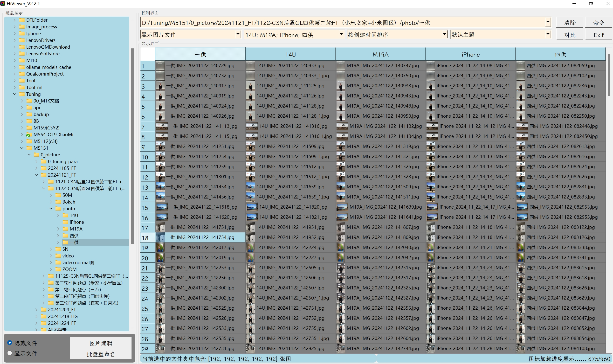
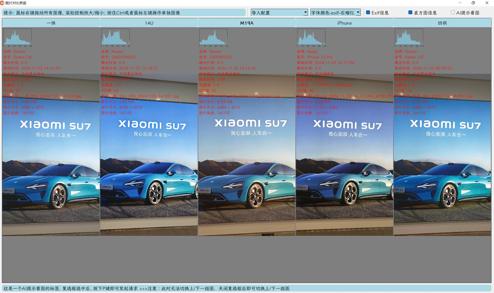
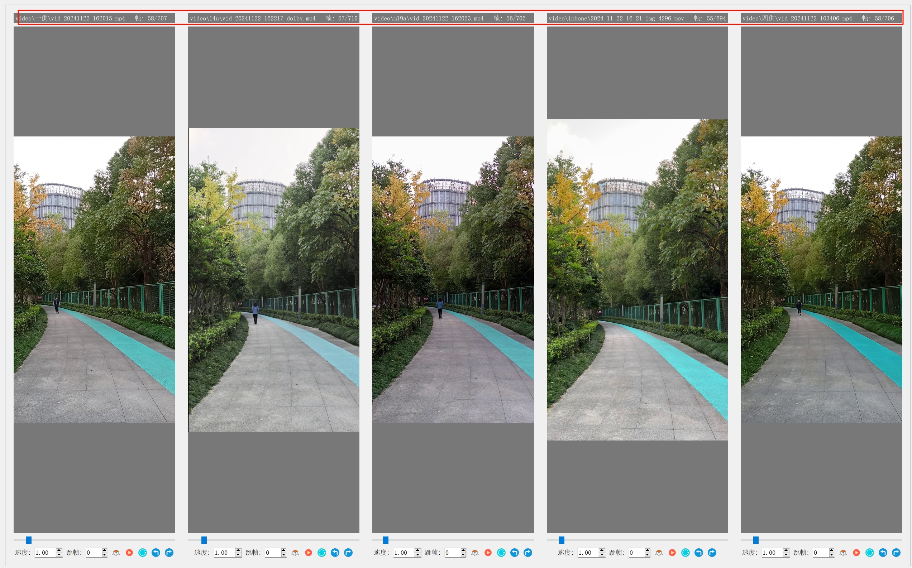
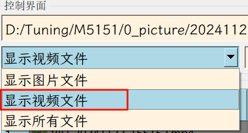
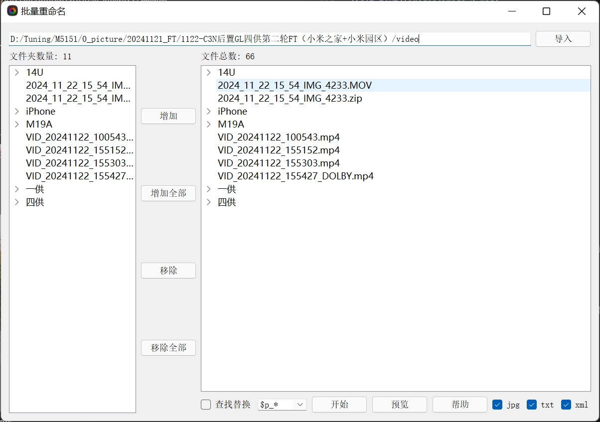
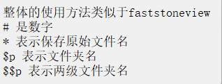
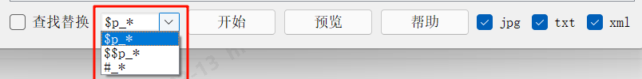
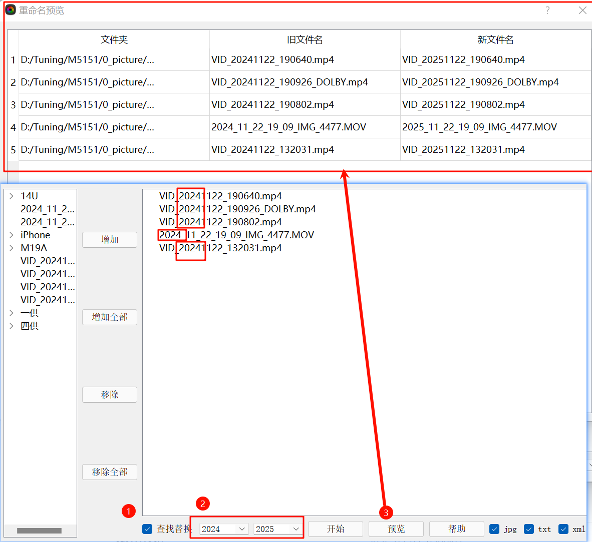
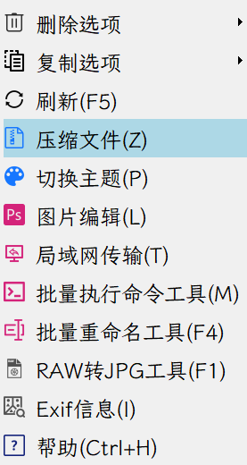
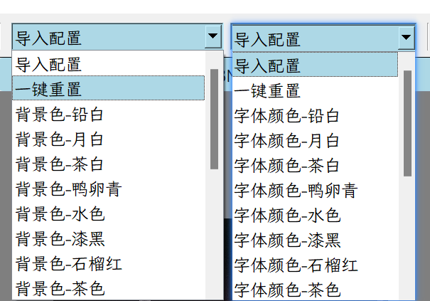

# Hiviewer_releases

HiViewer 看图工具，可支持多图片对比查看,多视频同步播放,并集成有AI提示看图、批量重命名文件、压缩复制文件、局域网传输文件以及存储常见ADB脚本并一键运行等多种实用功能...

## 主界面使用说明

### 1.快捷键使用说明

| 快捷键 | 使用说明                                                                                       |
| ------ | ---------------------------------------------------------------------------------------------- |
| Space  | 打开看图子界面并查看下一组图片，打开视频播放子界面并播放视频                                   |
| B      | 打开看图子界面并查看上一组图片，打开视频播放子界面并播放视频                                   |
| F1     | 打开raw2jpg工具                                                                                |
| F2     | 对当前选中的文件进行重命名                                                                     |
| F4     | 对当前选中的文件进行批量重命名                                                                 |
| F5     | 刷新表格内容                                                                                   |
| I      | 极简模式和解析模式切换，同按钮Exif功能。极简模式下，只显示图片文件名；解析模式下，显示Exif信息 |
| P      | 切换主题                                                                                       |
| L      | 打开图片处理工具                                                                               |
| M      | 打开ADB命令工具                                                                                |
| D      | D，删除当前选中的文件，暂未实现；CTRL+D，删除原文件                                            |
| Z      | 压缩当前选中的文件，自定义命名并粘贴到系统剪贴板中，缓存到路径/cache/下                        |
| T      | 打开局域网传输工具                                                                             |
| Esc    | 全局功能快捷键，可以退出当前界面                                                               |
| Ctrl+H | 全局功能快捷键，查看帮助信息                                                                   |

### 2.实用技巧说明

2.1.一键重命名选中的文件并压缩复制到系统剪贴板中，方便发送给其他同学：

- 选中需要重命名的文件，按下快捷键F2，选用需要的命名规则后，按下开始按钮重命名，完成后按下ESC退出返回主界面
  
- 按下F5刷新表格内容，选中需要压缩的文件，按下快捷键Z，压缩完成后，压缩文件会自动复制到系统剪贴板中

- 直接打开飞书等软件，Ctrl+V粘贴即可发送压缩的文件

2.2.一键切换主题，按下快捷键P，切换暗黑主题，再次按下快捷键P，切换浅色主题（默认主题）

2.3.一键打开局域网传输工具，按下快捷键T，打开局域网传输工具，支持链接发送给其他同学，支持选择共享本地特定文件夹

2.4.更多实用技巧，待挖掘...

---

## 看图子界面使用说明

### 1. 快捷键使用说明

| 快捷键        | 使用说明                                                                         |
| ------------- | -------------------------------------------------------------------------------- |
| Space         | 打开看图子界面并查看下一组图片，打开视频播放子界面并播放视频                     |
| B             | 打开看图子界面并查看上一组图片，打开视频播放子界面并播放视频                     |
| 鼠标左键      | 按住后拖拽，移动单个图片                                                         |
| 鼠标右键      | 按住后拖拽，移动所有图片                                                         |
| 鼠标滚轮      | 对所有图片进行放大缩小；另外，按下v键实现更小粒度的缩小，n键更小粒度的放大       |
| Ctrl+鼠标滚轮 | 对鼠标指针所在单个图片进行放大缩小                                               |
| Ctrl+A        | 向左旋转90度（针对鼠标指针所在图片）                                             |
| Ctrl+D        | 向右旋转90度（针对鼠标指针所在图片）                                             |
| Q             | 右边图片覆盖到左边（针对两张图片比较的情况）                                     |
| W             | 左边图片覆盖到右边（针对两张图片比较的情况）                                     |
| P             | 发起AI请求提示两张图片的差异（针对两张图片比较的情况，需要开启AI提示看图复选框） |
| ESC           | 全局功能快捷键，可以退出当前界面                                                 |

### 2. AI提示看图使用说明

1.仅适用于两张图片比较的情况，需要打开AI提示看图复选框，然后按下P键即可发起AI请求

2.当打开AI提示看图复选框时，无法使用ESC退出当前界面，无法使用Space/B键切换图片

3.当关闭AI提示看图复选框时，可以正常使用ESC、Space、B等快捷键功能，P键功能禁用

4.当前P键功能使用的是硅基流动API（deepseekvl2视觉模型）

5.要想体验更完善的功能可以到硅基流动官网 https://cloud.siliconflow.cn/i/yaICNWbd 注册使用

---

## 播放视频子界面使用说明

### 1. 快捷键使用说明

| 快捷键 | 使用说明                              |
| ------ | ------------------------------------- |
| Space  | 打开视频播放子界面并播放视频          |
| B      | 打开视频播放子界面并播放视频          |
| Q      | 暂停/播放 全部视频                    |
| W      | 从头播放  全部视频                    |
| E      | 提高所有视频播放速度，默认1.0倍速播放 |
| R      | 降低所有视频播放速度，默认1.0倍速播放 |
| ESC    | 全局功能快捷键，可以退出当前界面      |

### 2. 其它说明

1.使用播放视频子界面时，需要在主界面下拉框打开显示视频文件，否则无法显示视频文件

2.在主界面选中视频文件时，除了按下SPACE/B键打开视频，还可以按下对比按钮打开视频文件

3.在视频播放子界面，每个视频底下会显示单个视频的进度条和控制按钮（播放速度、跳帧设置，查找相似帧、暂停，从头播放、左旋转90度、右旋转90度）

---

## 批量重命名子界面使用说明

### 1. 快捷键使用说明

| 快捷键 | 使用说明                         |
| ------ | -------------------------------- |
| ESC    | 全局功能快捷键，可以退出当前界面 |

### 2. 其它说明

1.点击帮助按钮会有重命名的使用说明

2.在命名规则下拉框中，预置了常见的规则，选择命名规则后，可以点击预览查看是否符合预期，然后点击开始按钮，即可对文件进行重命名

3.查看替换复选框的使用，具体操作如下图，可以替换文件名中的指定字符

---

## 更新日志

### V2.2.0-2025.02.12

1. 修复了看图子界面图片显示尺寸太小问题
2. 修复了重命名界面闪退问题
3. 添加了帮助信息的相关显示
4. 使用新的局域网传输工具，支持链接发送

### V2.1.2-2025.02.06

1. 添加硅基流动api,导通看图子界面AI提示看图功能,AI回复准确率有待训练，基本功能导通完成
2. 增加版本控制关键字
3. 设置右键菜单，添加图标，将基本功能模块添加到右键菜单中，具体如下所示：

---

### V2.1.0-2025.01.22-大版本更新

1. 添加视频播放子界面，支持多视频对比播放
2. 添加压缩文件功能（快捷键Z），对选中的文件进行自定义命名并压缩，然后粘贴到系统剪贴板中，压缩文件后缀为.zip，默认存放在文件 ./cache/下
3. 添加对选中文件的复制，删除等功能
4. 优化文件夹选择下拉框，支持多选
5. 优化主题切换功能，支持自定义主题，支持P键切换暗黑模式和默认模式
6. 优化开机启动动画，大大提高程序启动速度和加载图标的速度

### V1.1.2-2025.01.16

1. 优化主界面显示，添加缓存机制
2. 添加开机启动动画功能
3. 优化ADB命令工具，支持手动存储adb脚本
4. 优化看图子界面，支持用户自定义颜色和字体功能，具体如下所示：

### V1.1.0-2025.01.02

1. 优化看图子界面的显示，支持鼠标滚轮对图片的放大和缩小，支持鼠标左右键对单个图片的移动和全局图片的移动
2. 优化看图子界面切图的处理速度以及进度条显示逻辑
3. 优化看图子界面exif信息的显示逻辑
4. 优化主界面的显示，添加了文件的缩略图显示，添加了默认图标

### V1.0.2-2024.12.31

1. 优化主界面加载图标导致内存占用过高的问题
2. 初步导通看图子界面功能模块

### V1.0.0-2024.12.18

1. 初步导通整个主界面的界面设计，以及看图子界面的界面设计，各个功能模块待完善
2. 添加git版本控制

---

  欢迎观看，已经到底啦^V^

